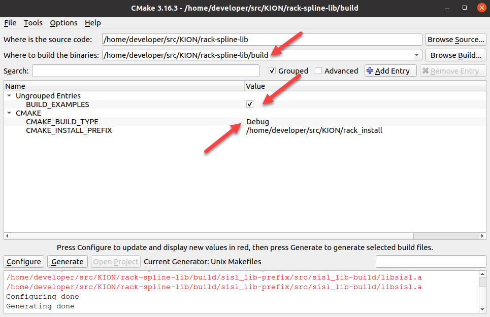

# How to Install and Run the Project

## 1) System pre-requisites:

## 2) Installation guide:
Move to the src/KION directory and clone the project:

    git clone https://github.com/kiongroup/rack-spline-lib.git
    
or 

    git clone git@github.com:kiongroup/rack-spline-lib.git
    
Change your active directory to the new rack-spline-lib folder and create a build folder:

    cd rack-spline-lib
    mkdir build
   
Change your active directory to the build folder and open the cmake gui:

    cd build 
    cmake-gui ..
    
Make sure to:
- set the build path
- check examples to automatically build along with rack-spline-lib 
- allow debug
- copy the rack installation directory 

as marked with red arrows below:

    
then, click "Configure" then "Generate" and close the gui. 

Finally, run the make command in your terminal:

    make 

You are now able to try the different splinesby running the different scripts.
